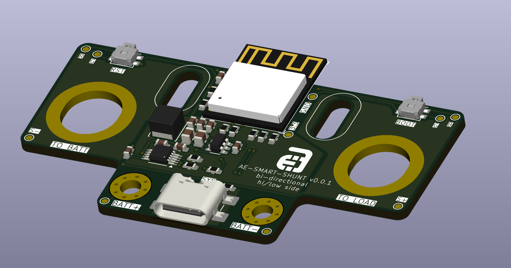
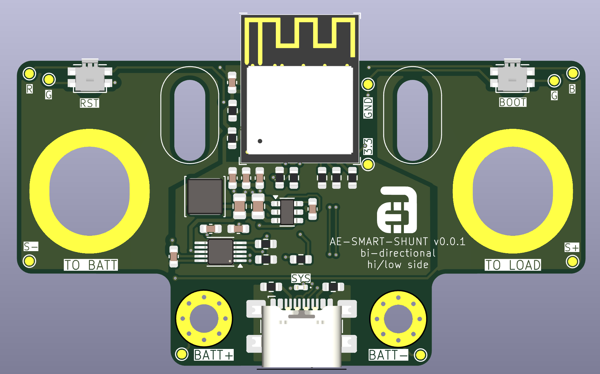
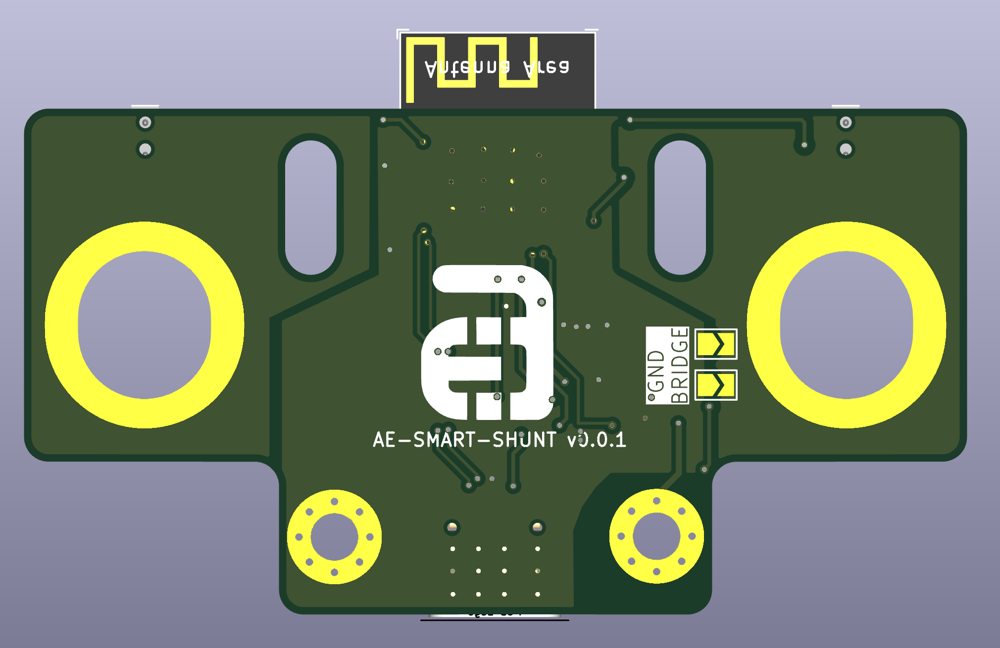

<h1 align="center">
  <a href="http://aceselectronics.com.au"></a>  

  Ace's Electronics Pty Ltd  
  Smart Battery Shunt
</h1>

# Looking to get up and running?
- [Wiki - Quickstart Guide](../../wiki/Quickstart-Guide)

# Project Goals:
The overall goal of this project is to make a simple, robust and reliable Ssmart batery shunt to monitor voltage, current and power of a lithium battery, or battery system.

# Design goals:  
- Smallest form-factor possible while being able to handle large currents, upwards of 300A, without getting too hot
- Zero maintenance
- Allow the data to be accessed from an OLED gauge, via BLE or ESPNow

# Features
- **High-Precision Monitoring**: Measures battery voltage, current, and power, and calculates state-of-charge (SOC).
- **Intuitive Current Reading**: Current is displayed as a positive value when the battery is charging and a negative value when discharging.
- **Persistent State**: Remembers battery capacity and calibration settings across power cycles.
- **ESP-NOW Broadcasting**: Transmits battery data wirelessly to other ESP devices.
- **Heartbeat LED**: A blinking LED provides a visual indication that the device is running.
- **Load Disconnect Control**: Includes an onboard MOSFET driver to disconnect the load in case of a fault.
- **Comprehensive Protection Suite**:
    - **Low-Voltage Disconnect**: Protects the battery from over-discharge. The device enters a low-power sleep mode, periodically waking to check if the battery has been recharged.
    - **Overcurrent Protection**: Disconnects the load if the current exceeds a configurable threshold.
    - **Short-Circuit Protection**: Uses the INA226's hardware alert pin for a fast-acting response to short circuits.
- **User-Configurable**: All protection parameters can be configured via the serial CLI.
- **In-Situ Calibration & Testing**: A guided CLI allows for accurate calibration and hardware verification without needing to re-flash the firmware.

# Commissioning
Before its first use, the smart shunt **must be calibrated**. The device will not be fully operational until this step is complete.
1.  Connect the device to a computer via USB.
2.  Open a serial monitor (e.g., the PlatformIO Serial Monitor) at **115200 baud**.
3.  Follow the on-screen prompts to run the calibration routines. You will be prompted to run the **Shunt Resistance Calibration (`r`)** first.
4.  Once calibration is complete, the device is ready for use.

# Serial Command-Line Interface (CLI)
The smart shunt is configured via a simple serial command-line interface. When connected, you can press a key followed by Enter to activate a command.

| Key | Command | Description |
|:---:|---|---|
| `f` | **Factory Reset** | Clears all settings and wipes all data - fresh like a daisy. |
| `r` | **Shunt Resistance Calibration** | Runs the NEW 5-point linear calibration routine (0-3A). Use this to fine-tune accuracy. |
| `v` | **Starter Voltage Calibration** | Runs the guided 8-point calibration routine for the starter battery voltage input. |
| `p` | **Protection Settings** | Allows you to configure the thresholds for Low-Voltage Cutoff, Hysteresis, Overcurrent Protection, and Voltage Compensation Resistance. |
| `l` | **Load Toggle** | Manually toggles the load disconnect MOSFET ON or OFF. Useful for testing the hardware circuit. |
| `a` | **Alert Toggle** | Toggles the hardware overcurrent alert ON or OFF. Useful for debugging. |
| `s` | **Status Display** | Displays the current protection settings, including the actual hardware alert threshold read from the INA226. |
| `d` | **Register Dump** | Prints the raw values of the INA226's key hardware registers for deep debugging. |
| `y` | **Export Voltage Calibration** | Prints the starter battery voltage calibration table in a C++-compatible format. |

# v0.0.1
Version 0.0.1 has been prototyped. I will hand assemble some test boards and do some testing. ~ETA for completion is 10/8/25.






# Where to Buy:
TBA, but most likely will be vvailable to purchase in Australia or New Zealand via <a href="https://d1b959-f7.myshopify.com/">The AE Store</a>

# Simulation Mode & Testing
For developers and testing purposes, a **Simulation Mode** is available. This overrides actual sensor readings with generated waveforms to verify the firmware logic and gauge UI responsiveness.

**Features in Simulation Mode:**
- **Voltage**: Sine wave from 10V to 15V (10s period).
- **Current**: Sine wave from -200A to +200A (20s period).
- **Error Cycling**: Automatically cycles through error states every 5 seconds:
    - Normal -> E-Fuse -> Load Off -> Over Current
- **Gauge Behavior**: The connected Gauge should display sweeping values and trigger a **Red Heartbeat** LED animation during error states.

**How to Run:**
Use the `simulation` environment in PlatformIO:
```bash
pio run -e simulation -t upload
```

## Support:
Contact me direct via ace<@>aceselectronics.com.au, just make it look like a normal email address. (hiding from the bots ;)
